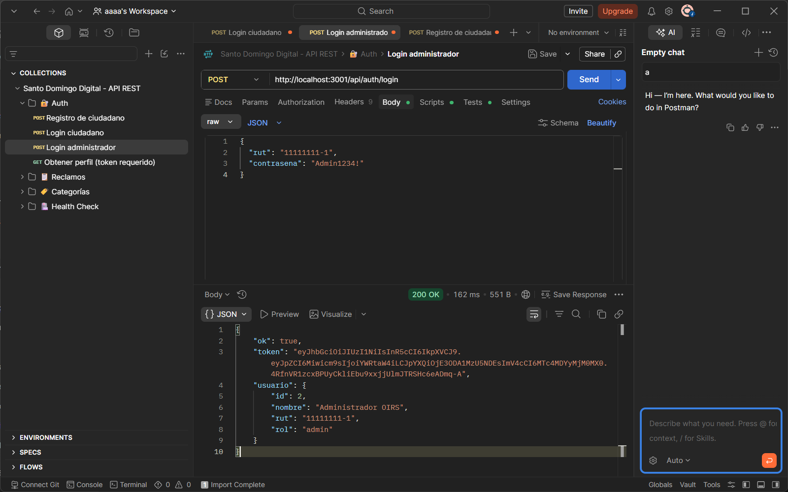
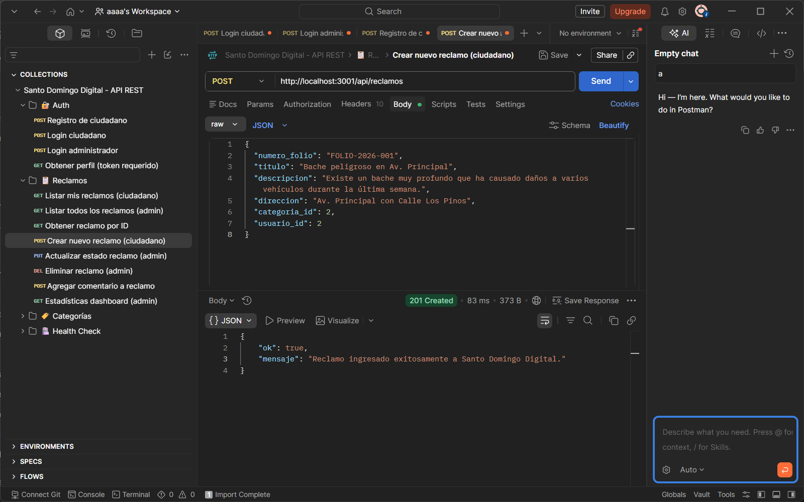

# Proyecto: Santo Domingo Digital — Entrega Parcial 2
**Desafío 35:** Baja capacidad de respuesta ante reclamos ciudadanos.

**Ramo:** Ingeniería Web y Móvil  
**Profesora:** Sandra Cano

## 1. Información del Proyecto

| Campo | Detalle |
|---|---|
| **Proyecto** | Santo Domingo Digital — Sistema de Reclamos Municipales |
| **Paralelo** | 2 |
| **Integrantes** | Matías Ruiz · Joaquín Castro · Álvaro Del Pino |
| **Repositorio** | https://github.com/xMrMaty/reclamos-muni |
| **Demo Frontend (Vercel)** | https://reclamos-muni.vercel.app |

---

## 2. Descripción de la Entrega

Esta entrega implementa el **backend completo** con API REST en Node.js + Express, conectado a una base de datos PostgreSQL, con autenticación JWT por roles (ciudadano / admin), y la integración con el frontend Ionic + React.

---

## 3. Tecnologías Utilizadas

### Backend
- **Node.js** + **Express.js** — Servidor API REST
- **PostgreSQL** — Base de datos relacional
- **JWT (jsonwebtoken)** — Autenticación por tokens
- **bcryptjs** — Hash seguro de contraseñas
- **express-validator** — Validación de inputs
- **cors** — Control de acceso entre dominios

### Frontend
- **Ionic + React + TypeScript**
- **Axios** — Cliente HTTP con interceptores JWT
- **React Router** — Navegación y rutas protegidas

---

## 5. Modelo Relacional de la Base de Datos

```
usuarios (id, nombre, rut, correo, region, comuna, password_hash, rol, activo, creado_en)
    │
    ├──< reclamos (id, numero_folio, titulo, descripcion, direccion, estado, prioridad,
    │              usuario_id FK, categoria_id FK, admin_id FK, unidad_tecnica,
    │              fecha_ingreso, fecha_actualizacion, fecha_resolucion, dias_plazo)
    │         │
    │         └──< comentarios_reclamo (id, reclamo_id FK, usuario_id FK,
    │                                   comentario, es_interno, creado_en)
    │
categorias (id, nombre, descripcion, activa)
```

---

## 6. Endpoints de la API

### 🔐 Autenticación

| Método | Endpoint | Descripción | Acceso |
|---|---|---|---|
| POST | `/api/auth/registro` | Registrar nuevo ciudadano | Público |
| POST | `/api/auth/login` | Iniciar sesión | Público |
| GET | `/api/auth/perfil` | Obtener perfil del usuario | Privado |

### 📋 Reclamos

| Método | Endpoint | Descripción | Acceso |
|---|---|---|---|
| GET | `/api/reclamos` | Listar reclamos (admin: todos, ciudadano: los suyos) | Privado |
| GET | `/api/reclamos/stats` | Estadísticas del dashboard | Admin |
| GET | `/api/reclamos/:id` | Detalle de un reclamo | Privado |
| POST | `/api/reclamos` | Crear nuevo reclamo | Ciudadano |
| PUT | `/api/reclamos/:id` | Actualizar estado/datos | Admin |
| DELETE | `/api/reclamos/:id` | Eliminar reclamo | Admin |
| POST | `/api/reclamos/:id/comentarios` | Agregar comentario | Privado |

### 🏷️ Categorías

| Método | Endpoint | Descripción | Acceso |
|---|---|---|---|
| GET | `/api/categorias` | Listar categorías activas | Público |
| POST | `/api/categorias` | Crear nueva categoría | Admin |
| DELETE | `/api/categorias/:id` | Desactivar categoría | Admin |

---

## 7. Instalación y Ejecución

### Requisitos previos
- Node.js >= 18
- PostgreSQL >= 14 instalado y corriendo
- npm

### Paso 1 — Clonar el repositorio
```bash
git clone https://github.com/xMrMaty/reclamos-muni.git
cd reclamos-muni
```

### Paso 2 — Configurar el backend

```bash
cd backend
npm install
```

Copiar el archivo de variables de entorno:
```bash
cp .env.example .env
```

Editar `.env` con tus credenciales de PostgreSQL:
```
DB_HOST=localhost
DB_PORT=5432
DB_NAME=reclamos_muni
DB_USER=postgres
DB_PASSWORD=TU_PASSWORD
JWT_SECRET=santo_domingo_digital_secret_key_2024
```

### Paso 3 — Crear la base de datos

En PostgreSQL (psql o pgAdmin):
```sql
CREATE DATABASE reclamos_muni;
```

Luego ejecutar el schema:
```bash
psql -U postgres -d reclamos_muni -f src/config/schema.sql
```

### Paso 4 — Iniciar el backend
```bash
npm run dev
```
El servidor quedará disponible en `http://localhost:3001`

Verificar que funciona: `http://localhost:3001/api/health`

### Paso 5 — Configurar y ejecutar el frontend

```bash
cd ../  # volver a la raíz del proyecto
npm install
npm run dev
```

El frontend quedará disponible en `http://localhost:5173`

### Credenciales de prueba
| Rol | RUT | Contraseña |
|---|---|---|
| Admin | `11111111-1` | `Admin1234!` |
| Ciudadano | Registrarse en `/registro` | La que elijas |
*(Usar la clave "contrasena" en el body del JSON)*

---

## 8. Pruebas Funcionales con Postman (Evidencias)

1. Abrir Postman e importar el archivo `SantoDomingo_API.postman_collection.json`.
2. Ejecutar primero **"Login administrador"** para obtener el token de acceso. El JSON del body espera el campo `"contrasena"` para validar las credenciales con hash Bcrypt.

### 📸 Capturas de Respaldo

A continuación se adjuntan las evidencias de las pruebas funcionales obligatorias corriendo localmente de forma exitosa:

#### A. Autenticación Exitosa (Login Administrador - 200 OK)
Se valida el descifrado del hash de la contraseña mediante Bcrypt y la correcta generación del token JWT.
* [Ver imagen en alta resolución](evidencia_login.png)



#### B. Creación de Reclamo (201 Created)
Se evidencia la persistencia del reclamo en PostgreSQL vinculando correctamente el `usuario_id` obtenido del token y el `numero_folio` obligatorio exigido por la base de datos.
* [Ver imagen en alta resolución](evidencia_reclamo.png)



### Credenciales de prueba integradas en Postman
| Rol | RUT | Campo Contraseña | Valor |
|---|---|---|---|
| Admin | `11111111-1` | `contrasena` | `Admin1234!` |

---

## 9. Seguridad implementada (EP 2.6)

- ✅ Hash de contraseñas con **bcryptjs** (salt rounds: 10)
- ✅ Autenticación con **JWT** (expiración configurable)
- ✅ Validación de inputs con **express-validator** (RUT, email, longitudes)
- ✅ Consultas con **parámetros preparados** en PostgreSQL (prevención de SQL Injection)
- ✅ **CORS** configurado solo para orígenes permitidos
- ✅ Diferenciación de roles (**ciudadano / admin**) en cada endpoint
